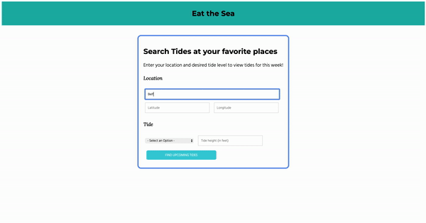

# Tide Tracker
This single-page web app was designed for fishermen, clammers, crabbers and outdoorspeople. It can:
   * Find favorable tides for fishing, crabbing and clam digging, based on user input.
   * Auto-saves location and tide instances for the user. User can delete either to further filter results.

## Why I Made This

Savoring food harvested direct-from-nature is one of my favorite activities, so I wanted to create an app to help me and other outdoors enthusiasts in this pursuit. I also wanted to strengthen my Javascript skills, such as async requests, event handlers and listeners, and controlled forms. On the backend, I learned more about concurrency and data-persistence as I moved from SQLite to Postgresql.

## Installing ##

- Fork and clone this repository
- run 'bundle install'
- launch rails server with 'rails s'
- open the index page from your terminal with 'open frontend/index.html'

## Operating Instructions ##

- Search tides at your favorite places to create/read instances of locations and tides (user_locations)
- Delete instances of tides and locations from the page.

To get started, you can use my favotire clamming beach, Belfair State Park:

- Name: Belfair State Park
- Lat: 47.4292
- Long: -122.8746

An ideal tide level for clamming is -1.5 low tide.

Happy clamming!
